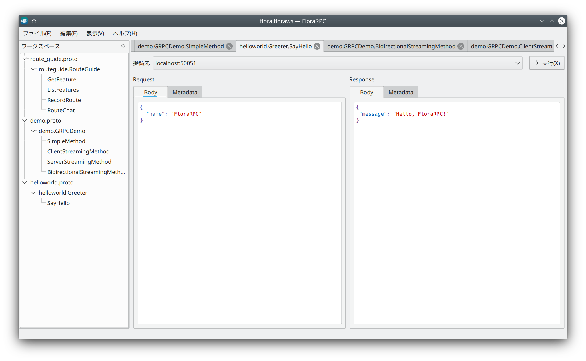

FloraRPC
====

<div align="center">
<br>

</div>

----

Qtを使ったgRPC GUI Clientです。  
既存のアプリはどれもWebベースであり、ネイティブのGUIツールキットを用いた実装がほとんど無かったので開発されました。

UIの構成は [BloomRPC](https://github.com/uw-labs/bloomrpc/) の影響を強く受けています。

## Dependencies
- Qt 5.15
- protobuf 3.11
- gRPC 1.27
- KSyntaxHighlighting 5.66

## Build (for Arch Linux)

```sh
$ yay -S cmake qt5-base protobuf grpc syntax-highlighting
$ git submodule update --init
$ mkdir -p build
$ cd build
$ cmake -DCMAKE_BUILD_TYPE=Release ..
$ cmake --build . -- -j8
```

## Build (for Windows)
### Additional prerequisites
* Perl (ex. http://strawberryperl.com/)

```bat
git submodule update --init

REM // install dependencies with vcpkg
nmake install_deps

REM // build
nmake dev
```

## Build (for macOS)

```sh
git submodule update --init

# install dependencies with vcpkg
make install_deps

# build
make dev
```
